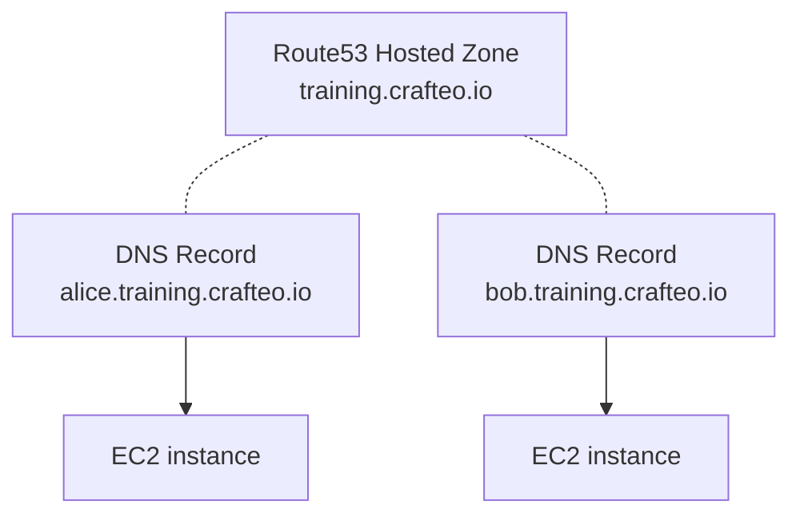

# Cloud Sandbox

Cloud Sandbox deploys sandbox environment on AWS for various usage.

A sandbox environment consists of EC2 instances with:
  - DNS records attached to each instances public IP
  - Basic instance configuration (SSH daemon)
  - Docker installation on each instance
  - [_code-server_](https://coder.com/docs/code-server/latest) available on 8080

Instances are available using human-friendly domain names such as `alice.training.crafteo.io`.



Infra is deployed with [Pulumi](https://www.pulumi.com/) and each instance is provisioned by [Ansible](https://www.ansible.com/).

## Requirements

- Pulumi 3.47+
- Ansible 2.9+
- AWS account with permission on Route53 and EC2
- An existing Route53 Hosted Zone for your domain name, such as `training.crafteo.io`

If you use [Nix](https://nixos.org/), simply run `nix develop` for a readily available environment

## Deploy

Configure your Pulumi stack:

- Copy template and update for your needs (see comments in template):
  ```sh
  cp pulumi/Pulumi.template.yaml pulumi/Pulumi.mysandbox.yaml
  ```
- Deploy:
  ```sh
  pulumi -C pulumi -s mysandbox up -yrf
  ```

Install Ansible deps (required once):

```
ansible-galaxy install -r requirements.yml
```

Configure Ansible inventory:

- Copy template and update for your needs (see comments in template):
  ```sh
  cp -R inventories/sample inventories/mysandbox
  ```
- Deploy:
  ```
  ansible-playbook -i inventories/mysandbox sandbox.yml
  ```

## Undeploy

```sh
pulumi -C pulumi -s mysandbox destroy -yrf
```