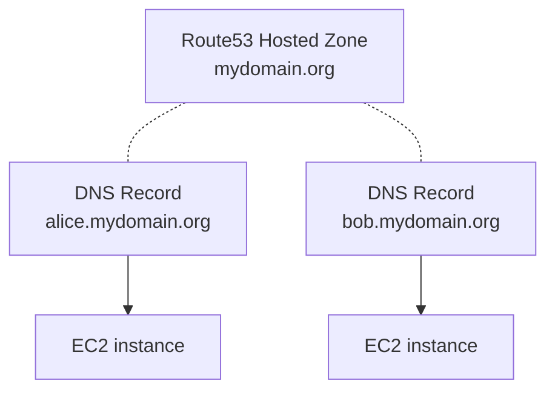

# Cloud Sandbox

Cloud Sandbox deploys sandbox environment on AWS for various usage.

A sandbox environment consists of EC2 instances with:
  - DNS records attached to each instances public IP
  - Basic instance configuration (SSH daemon)
  - Docker installation on each instance

Instances are available using human-friendly domain names such as `alice.mydomain.org`.



## Getting started

Requirements:

- Ansible 2.9+
- AWS account with access to CloudFormation and EC2
- EC2 keypair (to SSH into sandbox instances)
- Route53 Hosted Zone

Define your environment (either in extra vars file or in inventory)

```
# cat sandbox-config.yml
#
# Domain name under which create DNS records for instances
# Should match your Route53 Hosted Zone
cloud_sandbox_domain_name: mydomain.org

# Existing key name to use to configure EC2 instance
cloud_sandbox_key_name: "key-name"

# List of instances to create
# Each element will define DNS record for instance such as:
# - amelie.mydomain.org
# - bob.mydomain.org
cloud_sandbox_ec2_instances_names:
- amelie
- bob
```

Install dependencies and deploy sandbox:

```
ansible-galaxy install -r requirements.yml
ansible-playbook -e "@sandbox-config.yml" sandbox.yml
```

Destroy sandbox:

```
ansible-playbook -e "@sandbox-config.yml" sandbox-destroy.yml 
```

## Configuration

### Ansible inventory

You may create an Ansible inventory to better manage your sandbox environment. 

You can use template under `inventories/template` to create your own. See comments in `inventories/template/group_vars/all/main.yml` for common variables and usage.

You can then use more Ansible friendly:

```
ansible-playbook sandbox.yml -i inventories/yourinventory
```

### Advanced configuration

See roles default `roles/cloud_sandbox_infra/defaults/main.yml` and  `roles/cloud_sandbox_instance/defaults/main.yml` for variables you can override.
