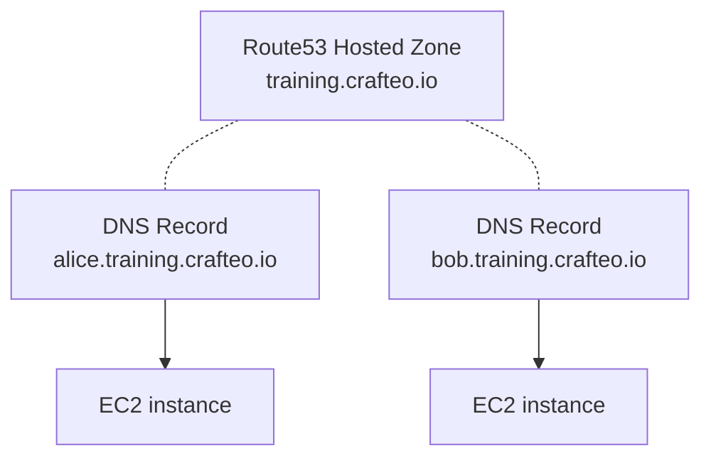

# Cloud Sandbox

- [Deploy Sandbox instances](#deploy-sandbox-instances)
  - [Requirements](#requirements)
  - [Configuration](#configuration)
  - [Deploy](#deploy)
    - [EC2 instances](#ec2-instances)
    - [Kubernetes cluster](#kubernetes-cluster)
    - [Docker Swarm](#docker-swarm)
- [Tests](#tests)
- [Undeploy](#undeploy)
- [Maintenance](#maintenance)

Cloud Sandbox deploys sandbox EC2 instances on AWS. I personally used them for training sessions (Docker, Ansible, etc.) but they can be used for pretty much anything. 

Sandboxes provides various tooling and services by default:
  - Reachable via human-friendly domain names such as `alice.training.crafteo.io`
  - [_code-server_](https://coder.com/docs/code-server/latest) available on port `8080` (with in-browser terminal)
  - Direct SSH access on port `22`
  - Tooling: Docker, Docker Compose, Git, etc.



Infra is deployed with [Pulumi](https://www.pulumi.com/) and each instance is provisioned by [NixOS](https://nixos.org/)

## Deploy Sandbox instances

### Requirements

- [Nix](https://nixos.org/) (provides development shell with Ansible, Pulumi and other dependencies)
- AWS account with permission on Route53 and EC2
- An existing Route53 Hosted Zone for sandbox domain name, such as `training.crafteo.io`

### Configuration

- Update `.novops.yml` with your desired environments

### Deploy

Start a Nix shell with all required dependencies:

```sh
nix develop
```

#### EC2 instances

Create Pulumi config under `pulumi/sandbox/Pulumi.ENVIRONMENT.yaml` (from `pulumi/sandbox/Pulumi.template.yaml`)

Deploy sandbox EC2 instances:

```sh
# Deploy ec2 instances
task ec2-instances

# Start/stop instances
task stop-ec2-instances
task start-ec2-instances
```

#### Kubernetes cluster

Create Pulumi config under `pulumi/eks/Pulumi.ENVIRONMENT.yaml` (from `pulumi/eks/Pulumi.template.yaml`)

```sh
# Deploy EKS cluster
task k8s-all
```

Deploy Example Voting App:

```sh
kubectl apply -f example-voting-app/resources/k8s
```

#### Docker Swarm

All deployed nodes can be configured as a single Docker Swarm cluster:

Deploy all nodes and setup Docker swarm:

```sh
task ec2-instances
task swarm
```

Leave Swarm:

```sh
task swarm-leave
```

docker swarm init

docker swarm join-token manager

docker swarm join --token SWMTKN-1-1dnosfsusiommgv5m6nudz07etj7mp0fayjc04xgn8wg5h96es-0xdrmvk2syo4s4kx5nvhe8u5o 192.168.0.136:237

docker stack deploy app-pierre -c docker-compose.yml

## Tests

Run tests:

```sh
task test-docker
task test-eks
```

## Undeploy

Destroy everything that may be deployed (EC2 instances, Kubernetes, etc.)

```sh
task destroy-all
```

## Maintenance

Bump versions:

- [ ] Cert Manager
- [ ] Cluster Autoscaler
- [ ] EKS
- [ ] Metrics Server
- [ ] Traefik
- [ ] Nix Flake
  - `nix flake update`
- [ ] NPM dependencies
  - `npm update`
- [ ] Update base image