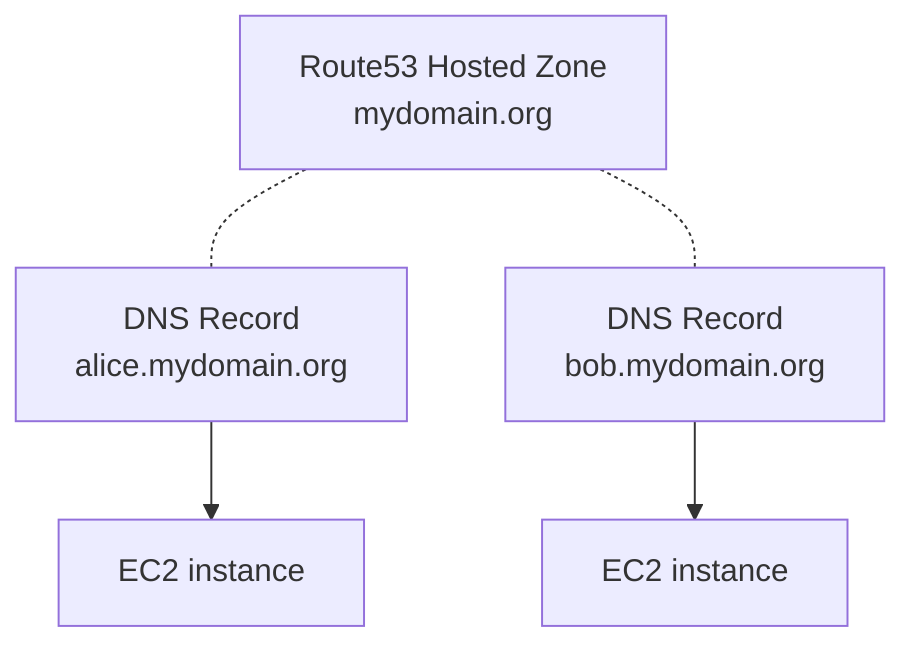

# Cloud Sandbox

Cloud Sandbox deploys sandbox environment on AWS for various usage.

A sandbox environment consists of EC2 instances with:
  - DNS records attached to each instances public IP
  - Basic instance configuration (SSH daemon)
  - Docker installation on each instance
  - [_code-server_](https://coder.com/docs/code-server/latest) available on 8080

Instances are available using human-friendly domain names such as `alice.mydomain.org`.



## Getting started


## Requirements

- Ansible 2.9+
- AWS account with access to CloudFormation and EC2

Before creating your Sandbox environment, ake sure mto:

- [ ] Create or import an EC2 key pair on AWS and save it locally under `.ssh/sandbox`
  
  Create new key pair:
  - AWS Console: _EC2 > Key Pairs > create key pair_
  - AWS CLI: 
    ```sh
    aws ec2 create-key-pair --key-name my-keypair | jq -r .KeyMaterial > .ssh/sandbox
    ```
  Or import existing key pair:
  - Create SSH key:
    ```
    ssh-keygen -t rsa -f .ssh/sandbox
    ```
  - AWS Console: _EC2 > Key Pairs > Actions > import key pair_
  - AWS CLI:
    ```
    aws ec2 import-key-pair --key-name my-keypair --public-key-material fileb://.ssh/sandbox.pub
    ```
  
- [ ] Create or ensure a Route53 Hosted Zone exists for your domain name and can be used to create public DNS record

## Deploy sandbox

Copy template inventory `inventories/sample` to your own and update. See comments for details on each configs.

Install dependencies (required only once):

```
ansible-galaxy install -r requirements.yml
```

Deploy Sandbox:

```
ansible-playbook -i inventories/my-inventory sandbox.yml
```

Destroy sandbox:

```
ansible-playbook -i inventories/my-inventory sandbox-destroy.yml 
```

## Advanced configuration

See
- EC2 infra: [`roles/cloud_sandbox_infra/defaults/main.yml`](./roles/cloud_sandbox_infra/defaults/main.yml)
- Ubuntu instance provisioning: [`roles/cloud_sandbox_instance/defaults/main.yml`](./roles/cloud_sandbox_instance/defaults/main.yml)
