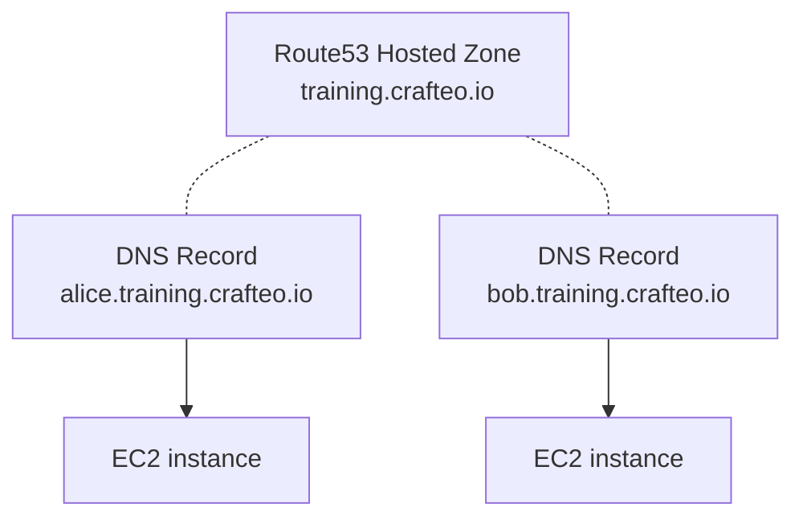

# Cloud Sandbox

Cloud Sandbox deploys sandbox EC2 instances on AWS. I personally used them for training sessions (Docker, Ansible, etc.) but they can be used for pretty much anything. 

Sandboxes provides various tooling and services by default:
  - Reachable via human-friendly domain names such as `alice.training.crafteo.io`
  - [_code-server_](https://coder.com/docs/code-server/latest) available on port `8080` (with in-browser terminal)
  - Direct SSH access on port `22`
  - Tooling: Docker, Docker Compose, Git, etc.
  - Kubernetes cluster with [k3s](https://k3s.io/) (all instances form a single cluster)



Infra is deployed with [Pulumi](https://www.pulumi.com/) and each instance is provisioned by [NixOS](https://nixos.org/)

## Deploy Sandbox instances

### Requirements

- [Nix](https://nixos.org/) (provides development shell with Ansible, Pulumi and other dependencies)
- AWS account with permission on Route53 and EC2
- An existing Route53 Hosted Zone for sandbox domain name, such as `training.crafteo.io`

### Deploy

Start a Nix shell with all required dependencies:

```sh
nix develop
```

#### EC2 instances

Deploy sandbox EC2 instances:

```sh
# Set your sandbox name
export SANDBOX_NAME=crafteo

# Copy Pulumi template and adapt to your needs
cp pulumi/sandox/Pulumi.template.yaml pulumi/sandox/Pulumi.$SANDBOX_NAME.yaml

# Deploy sandbox environment with Pulumi and Ansible
# Prompts for sandbox environment to use
make up

# Or run a specific deployment step
make pulumi     # Deploy Pulumi infra
make inventory  # Generate Ansible inventory from Pulumi output
make playbook   # Run additional Ansible config (very short)
```

#### Kubernetes cluster

```sh
# Set your sandbox name
export SANDBOX_NAME=crafteo

# Copy Pulumi template and adapt to your needs
cp pulumi/eks/Pulumi.template.yaml pulumi/eks/Pulumi.$SANDBOX_NAME.yaml

# Deploy EKS cluster
make eks

# Tooling: Traefik, Skooner
make traefik
make skooner
```

Deploy Example Voting App:

```sh
 kubectl apply -f example-voting-app/resources/k8s
```

## Tests

Run tests:

```sh
# Basic test
make test

# k3s test (needs k3sEnabled: true)
make test-k3s
```

## Undeploy

Destroy Pulumi stack

```sh
make down
```